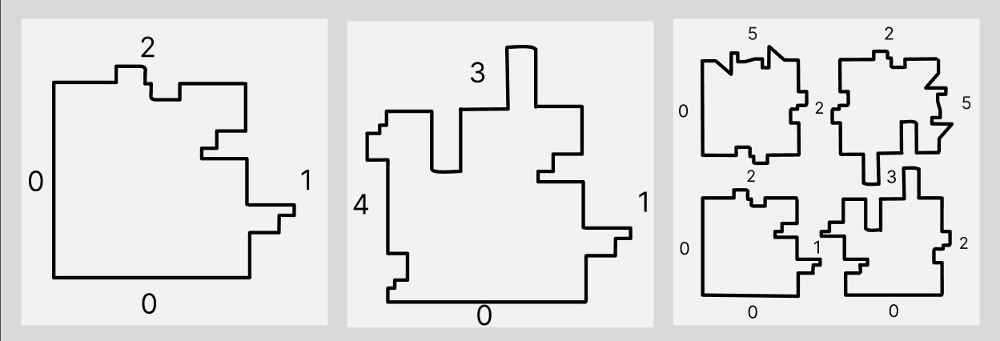

## CURRENTLY UNDER DEVELOPMENT

This script will solve a puzzle

All the pieces of our puzzle have four sides. Each one of the sides is represented by a positive integer. These numbers represent shapes. The number zero represents the border, which is a special side. 

For example, on these pieces, you can see sides 0 (border), 1, 2 and 3. Side 1 fits with side 1, side 2 would fit with side 2, etc. On the last images you can see how 3 pieces could fit together. 

There could be more than 2 pieces with the same side. That means that those pieces can fit together. 

The sides of the pieces are named sequentially, clockwise, starting with the left side. For example, the first piece is 0 2 1 0. 
